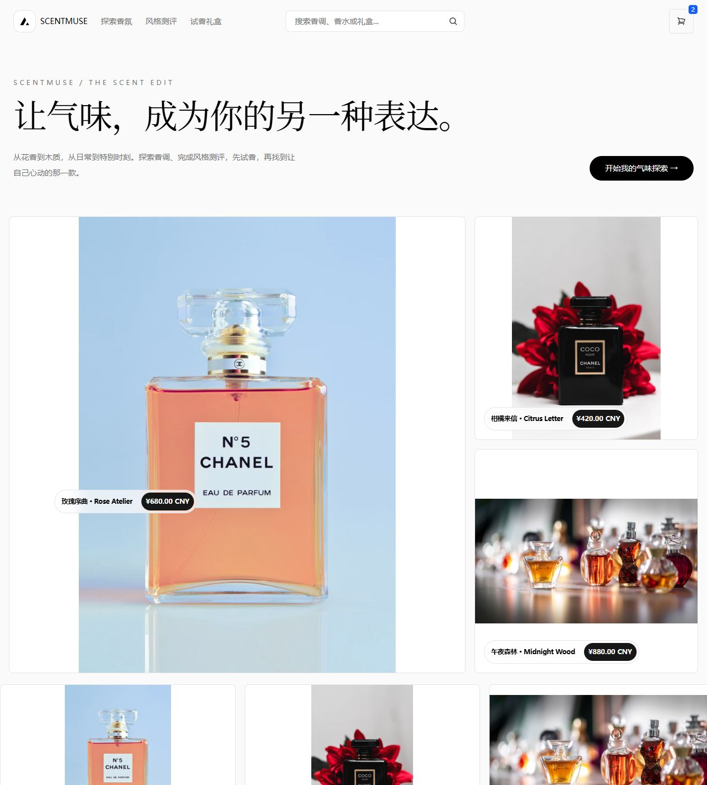

# ScentMuse · 香氛探索与试香产品 Demo

基于 [Vercel Commerce](https://github.com/vercel/commerce) 定制的个人美妆产品 Demo，保留原项目商品网格、搜索、详情图库、规格选择与购物车设计。



## 本次修改

- 香氛品牌首页与产品文案，8 件概念商品、4 个香调分类。
- 3 类风格导航，从偏好进入商品集合。
- 无 Shopify 账号也可运行的本地目录与独立浏览器购物车。
- 试香清单预览；不产生真实支付或订单。

## 运行

环境：Node.js 22.13+ 与 pnpm。

```bash
pnpm install --frozen-lockfile
pnpm dev --port 3101
```

打开 http://localhost:3101 。不需要 API Key。配置 Shopify 后仍可使用保留的上游提供器。

## 产品材料

[产品方案](docs/PRODUCT.md) · [验收记录](docs/QA.md) · [上游与授权](UPSTREAM.md) · [原始 README](README.upstream.md)

MIT License，原版权见 license.md。远程图片来自 Unsplash 示例，概念商品名称与价格为模拟数据。
